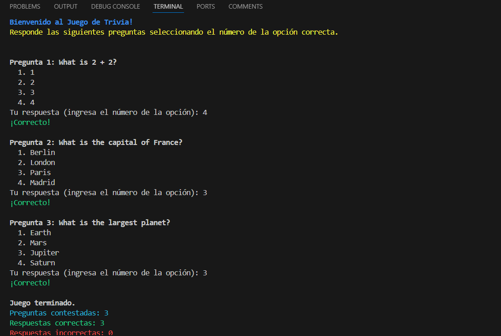
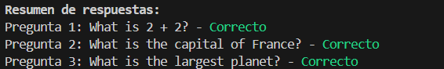

# Desarrollo de Software - Tarea 1: Proyecto "Juego de Trivia" con FastAPI, PostgreSQL y DevOps

En esta tarea se desarrollará un proyecto completo de un juego de trivia utilizando FastAPI para la API, PostgreSQL para la base de datos, y prácticas de DevOps como contenedorización con Docker y gestión del pipeline CI/CD con GitHub Actions. Se cubrirán aspectos de desarrollo de la lógica del juego, pruebas unitarias, integración y despliegue continuo, así como la implementación de características adicionales como la dificultad del juego.

# Índice

 ## [1. Sprint 1: Estructura básica y preguntas](#sprint-1-estructura-básica)
 ## [2. Sprint 2: Lógica del juego y puntuación](#sprint-2-lógica-del-juego-y-puntuación)
 ## [3. Sprint 3: Mejoras en la interfaz y refinamiento](#sprint-3-mejoras-en-la-interfaz-y-refinamiento)
---

## Sprint 1: Estructura básica y preguntas

### Objetivo:
En este primer sprint, el objetivo es establecer la estructura básica del proyecto utilizando FastAPI y Docker, y desarrollar la lógica principal para la manipulación y presentación de preguntas y respuestas del juego de trivia.

### Tareas:
1. Configuración del entorno con FastAPI y Docker.
    - Crear la estructura del proyecto:
    ```bash
    mkdir trivia-game-python
    cd trivia-game-python
    python3 -m venv venv
    source venv/bin/activate
    pip install fastapi uvicorn
    pip install asyncpg databases
    ```
    - Usaremos GitHub Flow por tal razón se creará una nueva rama para trabajar con el Sprint 1:
    ```bash
    git init
    git checkout -b feature/structure-basic
    ```
    - Crear un archivo `Dockerfile` para el entorno de FastAPI y PostgreSQL
    ```Dockerfile
    FROM python:3.9-slim

    WORKDIR /app

    COPY requirements.txt .

    RUN pip install --no-cache-dir -r requirements.txt

    COPY . .

    EXPOSE 8000

    CMD ["uvicorn", "main:app", "--host", "0.0.0.0", "--port", "8000"]
    ```
    - Crear un archivo `docker-compose.yml` para gestionar PostgreSQL
    ```yml
    version: '3.8'

    services:
        db:
            image: postgres:13
            environment:
            POSTGRES_USER: user
            POSTGRES_PASSWORD: password
            POSTGRES_DB: trivia_db
            ports:
            - "5432:5432"
        web:
            build: .
            command: uvicorn main:app --host 0.0.0.0 --port 8000
            ports:
            - "8000:8000"
            volumes:
            - .:/app
            environment:
            DATABASE_URL: postgres://user:password@db:5432/trivia_db
            depends_on:
            - db
    ```
2. Implementación de la clase `Question` para gestionar las preguntas.
    - Para realizar la implementación se realizó la siguiente estructura para este proyecto:

        * app/: Contiene la lógica de la aplicación y su estructura principal.
            - `__init__.py`: Indica que `app` es un paquete de Python.
            - `main.py`: Archivo principal de ejecución de la aplicación.
            - `models.py`: Definición de los modelos y estructuras de datos.
            - `routes.py`: Definición de las rutas de la API.

        * test/ : Contiene las pruebas unitarias y funcionales
            - `__init__.py`: Indica que `tests` es un paquete de Python.
            - `test_question.py`: Pruebas unitarias para la clase `Question`.
            - `test_quiz.py`: Pruebas unitarias para la clase `Quiz`.

    - Luego de haber realizado la estructura anterior, podemos implementar la clase `Question` en `models.py`:
    ```python
    class Question:
        def __init__(self, description, options, correct_answer):
            self.description = description  # Descripción de la pregunta
            self.options = options  # Opciones de respuesta
            self.correct_answer = correct_answer  # Respuesta correcta
        def is_correct(self, answer):
            return self.correct_answer == answer
    ```
3. Desarrollo de la clase `Quiz` para manejar el flujo del juego.
    - En el mismo archivo `models.py` se crea la clase `Quiz` en este caso debajo de `Question`:
    ```python
    class Quiz:
        def __init__(self):
            self.questions = []
            self.current_question_index = 0
        def add_question(self, question):
            self.questions.append(question)
        def get_next_question(self):
            if self.current_question_index < len(self.questions):
                question = self.questions[self.current_question_index]
                self.current_question_index += 1
                return question
            return None
    ```
4. Pruebas unitarias para la clase `Question`.
    - Instalamos `pytest`
    ```bash
    pip install pytest
    ```
    - En este caso, nos posicionamos en `tests/` y nos creamos un archivo con el nombre `test_question.py` 
    ```python
    from app.models import Question, Quiz

    def test_question_correct_answer():
        question = Question("What is 2 + 2?", ["1", "2", "3", "4"], "4")
        assert question.is_correct("4")

    def test_question_incorrect_answer():
        question = Question("What is 2 + 2?", ["1", "2", "3", "4"], "4")
        assert not question.is_correct("2")
    ```

5. Gestión de Git y creación de ramas.
    - Para este proyecto se usó GitHub Flow:
    ```bash
    git push origin feature/structure-basic
    ```
    - Luego se realizó una Pull Request y finalmente se aceptó la PR.


---

## Sprint 2: Lógica del juego y puntuación

### Objetivo:
En este sprint, se implementará el sistema de puntuación, se refinará la lógica del juego para manejar múltiples rondas, y se añadirá la funcionalidad de terminación del juego después de un número determinado de preguntas.

### Tareas:
1. Ampliar la clase `Quiz` para manejar puntuaciones.
- Antes de empezar, creamos una nueva rama a partir de `main`
```
git checkout -b feature/quiz-logic
```
- Continuamos trabajando:
```python
class Quiz:
    def __init__(self):
        self.questions = []
        self.current_question_index = 0
        self.correct_answers = 0
        self.incorrect_answers = 0

    def add_question(self, question):
        self.questions.append(question)

    def get_next_question(self):
        if self.current_question_index < len(self.questions):
            question = self.questions[self.current_question_index]
            self.current_question_index += 1
            return question
        return None

    def answer_question(self, question, answer):
        if question.is_correct(answer):
            self.correct_answers += 1
            return True
        else:
            self.incorrect_answers += 1
            return False
```

2. Implementar pruebas unitarias para el sistema de puntuación en la clase `test_question.py`
```python
def test_quiz_scoring():
    # Crear una instancia de Quiz y agregar una pregunta
    quiz = Quiz()
    question = Question("What is 2 + 2?", ["1", "2", "3", "4"], "4")
    quiz.add_question(question)
    
    # Responder la pregunta correctamente y verificar la puntuación
    assert quiz.answer_question(question, "4") == True
    assert quiz.correct_answers == 1
    assert quiz.incorrect_answers == 0
```
3. Añadir lógica para la gestión de rondas y el fin del juego en `main.py`
```python
def run_quiz():
    quiz = Quiz()

    # Aquí se cargarían las preguntas, por ejemplo:
    question1 = Question("What is 2 + 2?", ["1", "2", "3", "4"], "4")
    question2 = Question("What is the capital of France?", ["Berlin", "London", "Paris", "Madrid"], "Paris")

    # Agregar las preguntas al quiz
    quiz.add_question(question1)
    quiz.add_question(question2)

    # Lógica del juego
    while quiz.current_question_index < 10:
        question = quiz.get_next_question()
        if question:
            print(question.description)
            for idx, option in enumerate(question.options):
                print(f"{idx + 1}) {option}")
            answer = input("Tu respuesta: ")
            if quiz.answer_question(question, answer):
                print("¡Correcto!")
            else:
                print("Incorrecto.")
        else:
            break

    print(f"Juego terminado. Respuestas correctas: {quiz.correct_answers}, incorrectas: {quiz.incorrect_answers}")
```
4. Fusión de ramas en Git.
   ```bash
   git push origin feature/quiz-logic
   ```
   - Se realiza una PR y luego se espera para la aceptación.
---

## Sprint 3: Mejoras en la interfaz y refinamiento

### Objetivo:
Este sprint se centra en mejorar la interfaz de usuario en la consola, agregar niveles de dificultad al juego, y proporcionar un resumen detallado al final de cada sesión de juego.

### Tareas:
1. Refinar la interfaz de usuario.
    - Se mejora la presentación de la consola con un aspecto más amigable:
    ```python
    from models import Quiz, Question
    def run_quiz():
        # Mensaje de bienvenida y explicación
        print("\033[1m\033[94mBienvenido al Juego de Trivia!\033[0m")
        print("\033[93mResponde las siguientes preguntas seleccionando el número de la opción correcta.\033[0m\n")

        # Crear una instancia de Quiz
        quiz = Quiz()

        # Cargar preguntas de ejemplo
        question1 = Question("What is 2 + 2?", ["1", "2", "3", "4"], "4")
        question2 = Question("What is the capital of France?", ["Berlin", "London", "Paris", "Madrid"], "Paris")
        question3 = Question("What is the largest planet?", ["Earth", "Mars", "Jupiter", "Saturn"], "Jupiter")
        
        # Lógica del juego ...
    ```
    - Detalles de lo visto en el código:
        * **\033[1m**: Establece el texto en negrita.
        * **\033[94m**: Aplica el color azul al texto.
        * **\033[93m**: Aplica el color amarillo al texto.

2. Introducir niveles de dificultad.
- En `models.py`se modifica la clase `Quiz`
```python
class Quiz:
    def __init__(self):
        self.questions = []  # Lista de preguntas
        self.current_question_index = 0  # Índice de la pregunta actual
        self.correct_answers = 0  # Respuestas correctas
        self.incorrect_answers = 0  # Respuestas incorrectas
        self.difficulty = "Normal"  # Nivel de dificultad inicial
        self.answers = []  # Registrar las respuestas del usuario

    def add_question(self, question):
        self.questions.append(question)

    def get_next_question(self):
        if self.current_question_index < len(self.questions):
            question = self.questions[self.current_question_index]
            self.current_question_index += 1
            return question
        return None

    def answer_question(self, question, answer):
        # Convertir el input del usuario a la opción correspondiente
        try:
            selected_option = int(answer) - 1  # Convertir el número a índice de lista
            self.answers.append(selected_option)  # Registrar el índice de la opción seleccionada
            if question.options[selected_option] == question.correct_answer:
                self.correct_answers += 1
                if self.correct_answers >= 3:
                    self.difficulty = "Difícil"
                return True
            else:
                self.incorrect_answers += 1
                if self.incorrect_answers >= 3:
                    self.difficulty = "Fácil"
                return False
        except (ValueError, IndexError):
            print("Entrada no válida. Inténtalo de nuevo.")
            return False
```
- Se agregó una lógica de niveles de dificultad a la clase `Quiz`. El nivel de dificultad cambia en función de la cantidad de respuestas correctas e incorrectas que el usuario haya acumulado. 
    ***Descripción del Comportamiento***
    - **Inicialmente**: El nivel de dificultad se establece en "Normal".
    - **Cambio a `"Difícil"`**: Si el jugador responde correctamente a 3 o más preguntas consecutivas, el nivel de dificultad se cambia a "Difícil".
    - **Cambio a `"Fácil"`**: Si el jugador responde incorrectamente a 3 o más preguntas consecutivas, el nivel de dificultad se cambia a "Fácil".

3. Mostrar un resumen detallado al final del juego.

```python
    # Mostrar resultados al final del juego
    print("\033[1m\nJuego terminado.\033[0m")
    print(f"\033[96mPreguntas contestadas: {quiz.current_question_index}\033[0m")
    print(f"\033[92mRespuestas correctas: {quiz.correct_answers}\033[0m")
    print(f"\033[91mRespuestas incorrectas: {quiz.incorrect_answers}\033[0m\n")

    # Resumen detallado de respuestas correctas e incorrectas
    print("\033[1mResumen de respuestas:\033[0m")
    for idx, question in enumerate(quiz.questions):
        user_answer_index = quiz.answers[idx]  # Obtener el índice de la respuesta seleccionada por el usuario
        user_answer = question.options[user_answer_index]  # Obtener la respuesta seleccionada a partir del índice
        correct_or_not = "Correcto" if question.is_correct(user_answer) else "Incorrecto"
        color = "\033[92m" if correct_or_not == "Correcto" else "\033[91m"
        print(f"Pregunta {idx + 1}: {question.description} - {color}{correct_or_not}\033[0m")
```
4. Implementar pruebas unitarias adicionales.
- Para realizar esto trabajaremos en `tests/`:
    - Modificaremos el archivo `test_question.py` para que se realicen pruebas unitarias a la clase `Question`:
    ```python
    from ..app.models import Question, Quiz

    def test_question_correct_answer():
        question = Question("What is 2 + 2?", ["1", "2", "3", "4"], "4")
        assert question.is_correct("4")

    def test_question_incorrect_answer():
        question = Question("What is 2 + 2?", ["1", "2", "3", "4"], "4")
        assert not question.is_correct("2")

    ```
    - En `test_quiz.py` se realiza pruebas unitarias para la clase `Quiz`:
     ```python
     from ..app.models import Quiz, Question

    def test_quiz_difficulty_increase():
        # Prueba para verificar que la dificultad cambia a "Difícil" después de 3 respuestas correctas
        quiz = Quiz()
        question = Question("What is 2 + 2?", ["1", "2", "3", "4"], "4")
        for _ in range(4):  # Responder correctamente más de 3 preguntas
            quiz.add_question(question)
            quiz.answer_question(question, "4")
        assert quiz.difficulty == "Difícil"

    def test_quiz_difficulty_decrease():
        # Prueba para verificar que la dificultad cambia a "Fácil" después de 3 respuestas incorrectas
        quiz = Quiz()
        question = Question("What is 2 + 2?", ["1", "2", "3", "4"], "4")
        for _ in range(4):  # Responder incorrectamente más de 3 preguntas
            quiz.add_question(question)
            quiz.answer_question(question, "3")  # Respuesta incorrecta
        assert quiz.difficulty == "Fácil"

    def test_quiz_correct_and_incorrect_answers():
        # Prueba para validar el conteo de respuestas correctas e incorrectas
        quiz = Quiz()
        question = Question("What is 2 + 2?", ["1", "2", "3", "4"], "4")
        quiz.add_question(question)

        # Responder correctamente
        quiz.answer_question(question, "4")
        assert quiz.correct_answers == 1
        assert quiz.incorrect_answers == 0

        # Responder incorrectamente
        quiz.answer_question(question, "3")
        assert quiz.correct_answers == 1
        assert quiz.incorrect_answers == 1

    def test_quiz_flow_of_questions():
        # Prueba para validar el flujo correcto de preguntas en el quiz
        quiz = Quiz()
        question1 = Question("What is 2 + 2?", ["1", "2", "3", "4"], "4")
        question2 = Question("What is the capital of France?", ["Berlin", "London", "Paris", "Madrid"], "Paris")
        quiz.add_question(question1)
        quiz.add_question(question2)

        # Validar que las preguntas se presentan en el orden correcto
        next_question = quiz.get_next_question()
        assert next_question == question1
        next_question = quiz.get_next_question()
        assert next_question == question2
        # Verificar que no quedan más preguntas
        next_question = quiz.get_next_question()
        assert next_question is None

     ```
- Al culminar todos los cambios se sube la rama, realizamos una PR y se espera la aceptación de la PR.

5. Configurar GitHub Actions para un pipeline CI/CD básico.
- Se crea una nueva rama a partir de main que sería `git checkout -b feature/ci-pipeline`
- Luego se crea siguiente carpeta:
```bash
mkdir -p .github/workflows
cd workflows
nano ci.yml
```
- Se usa `-p` para crear directorios de manera recursiva
- Luego configuramos el `ci.yml`:
```yml
name: Python CI

on:
  push:
    branches:
      - develop
      - main
  pull_request:
    branches:
      - develop
      - main

jobs:
  build:
    runs-on: ubuntu-latest

    steps:
    - name: Checkout code
      uses: actions/checkout@v2

    - name: Set up Python
      uses: actions/setup-python@v2
      with:
        python-version: '3.9'

    - name: Install dependencies
      run: pip install -r requirements.txt

    - name: Run tests
      run: pytest
```
- Y no olvidemos de crear el archivo .txt fuera de la carpeta que creamos. Este archivo `requirements.txt` contendrá todas las dependencias.
```
pytest
```
- Finalmente realizamos `push`, realizamos una PR y se espera la confirmación.

***Resultado del juego***


---


